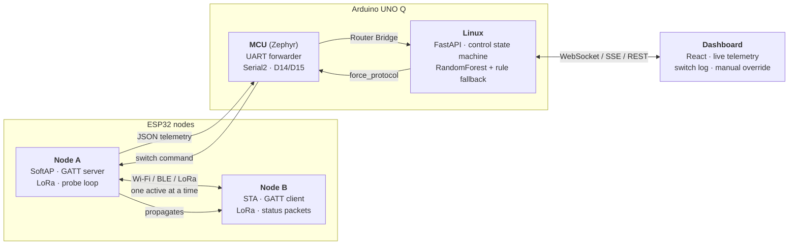
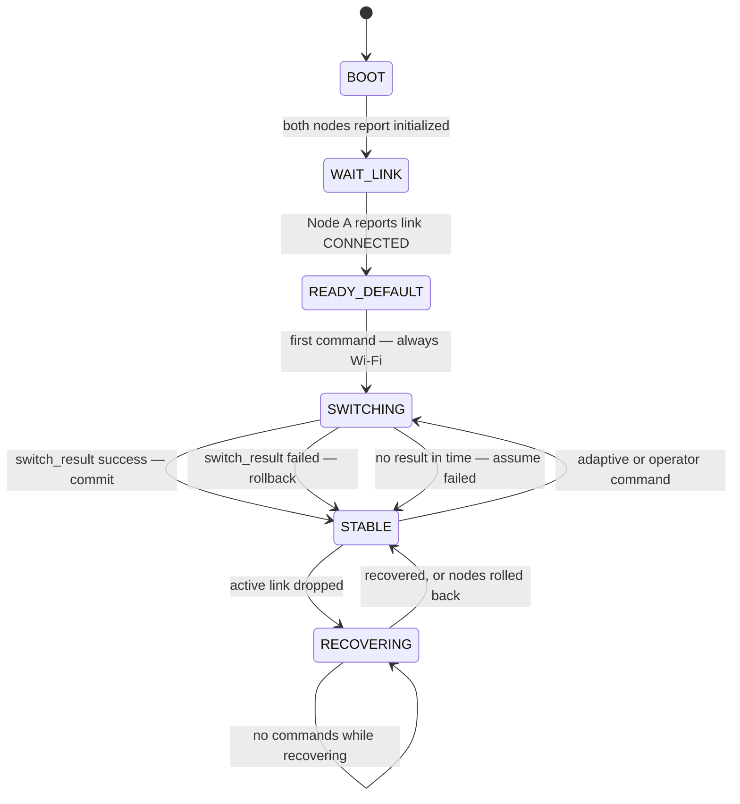

<div align="center">



<br>

**Two ESP32 nodes. Three radios. One link that moves itself to whichever radio is actually working.**


</div>

---

## The problem

A radio that is perfect indoors is useless across a field. A radio that reaches a kilometre can't carry video. Most systems pick one at design time and live with it.

SWAP doesn't pick. Two nodes hold a single logical link and move it between **Wi-Fi**, **BLE** and **LoRa** as conditions change — measuring the link continuously, deciding centrally, and validating every change before trusting it.

<div align="center">

</div>

---

## The rule that makes it safe

A protocol switch is a leap. You tear down a working link and hope the next one comes up — and if it doesn't, you've disconnected yourself while trying to improve.

So **every switch is a 5-second trial**. The nodes bring up the new radio and prove it carries traffic. If it does, the protocol commits. If it doesn't, both nodes revert to whatever was running before — which is *not* always LoRa, it's whatever was last known good.

<div align="center">

</div>

While a trial is running, no second switch is allowed. One transition at a time, no overlapping trials, no way for the two nodes to end up disagreeing about which radio they're on.

---

## How a decision gets made

<div align="center">

</div>

Node A probes the active link every second (every 3 s on LoRa, whose airtime is far more expensive) and emits a combined frame every 4 seconds — RSSI, measured packet loss from the probe/ACK loop, round-trip time, jitter, SNR, airtime — carrying Node B's readings alongside its own. That goes up a UART to the UNO Q, where a rolling 10-frame window feeds a RandomForest classifier, with a deterministic rule-based path taking over whenever the model is unavailable or unsure.

The recommendation then has to get past the gate. Most of the time it doesn't, and that's the point:

| Guard | What it stops |
|---|---|
| **Link connected** | Commanding a switch on a link that isn't up |
| **No transition in flight** | Overlapping trials and state races |
| **Hysteresis margin** | Flapping when two protocols score within noise of each other |
| **5s dwell** | Switching more often than a link can settle |
| **BLE last** | Picking BLE unless it clearly beats everything else |
| **3s BLE settle** | Commanding again before a fresh BLE connection has stabilised |

---

## Architecture



**The split is deliberate.** The UNO Q decides *whether and when* to switch and gates every command. The nodes execute the switch, run the trial, judge whether the new radio actually works, roll back on failure, and report the outcome. Neither side can unilaterally leave the link in a bad state.

---

## The control state machine

<details open>
<summary><b>States and transitions</b></summary>



LoRa is the **boot** protocol — it's the one link that comes up without a peer already listening on a specific SSID or GATT service. Wi-Fi is the **first operating** protocol, commanded only once both nodes have announced themselves *and* the link is genuinely carrying traffic. Being initialized and being connected are tracked separately, because a node can be perfectly alive with a dead link.

</details>

Implemented in [`swap_backend/control.py`](swap_backend/control.py) as one explicit machine rather than conditionals spread through request handlers, so protocol state, transition state, connectivity and rollback state cannot drift apart. [`tests/test_control_spec.py`](tests/test_control_spec.py) pins each rule to its clause in the spec — **21 tests, no pytest required**:

```bash
python tests/test_control_spec.py
```

---

## Quick start

<details open>
<summary><b>Run the whole system on your laptop — no hardware</b></summary>

The simulator plays the node side of the contract: boot handshake, one shared link, real 5-second trials that succeed or fail on simulated conditions, and autonomous recovery rollback.

```bash
python -m pip install -r requirements.txt
```
```bash
python -m uvicorn swap_backend.app:app --host 127.0.0.1 --port 8000
```
```bash
cd swap-frontend && npm install && npm run dev
```

Open the dashboard and point it at the backend — no rebuild needed to change target:

```
http://localhost:5173/?backend=127.0.0.1:8000
```

Watch the log: `boot → wait_link → ready_default → SWITCHING(WIFI) → trial → commit or rollback → stable`.

</details>

<details>
<summary><b>Run it on the UNO Q, against real nodes</b></summary>

`uno_q_backend/` is the App Lab app: the same backend, fed by the Router Bridge instead of the simulator.

```bash
python3 -m venv venv && source venv/bin/activate
```
```bash
pip install -r uno_q_backend/python/requirements.txt
```
```bash
cd uno_q_backend/python && python main.py
```

`main.py` sets `SWAP_INPUT_MODE=serial` and serves on `0.0.0.0:8000` (override with `SWAP_PORT`). The first log lines tell you whether WebSocket support is available — if not, the dashboard falls back to SSE on its own.

Flash `uno_q_backend/sketch/sketch.ino` to the UNO Q's MCU and `swap_node_a` / `swap_node_b` to the two ESP32s.

</details>

<details>
<summary><b>Wiring</b></summary>

| From | To | Notes |
|---|---|---|
| Node A `GPIO17` (TX) | UNO Q `D14` (RX) | Serial2 — **not** D0/D1 |
| Node A `GPIO16` (RX) | UNO Q `D15` (TX) | |
| GND | GND | common ground required |

Both ends at **115200 8N1**. D0/D1 is the Zephyr console UART — sharing it with Node A interleaves boot-log output into the telemetry stream and produces shredded frames like `{"li{"li{`.

**LoRa (SX1262):** 866 MHz · SF7 · BW 125 kHz · CR 4/5 · +14 dBm · NSS 13, DIO1 26, RESET 33, BUSY 27, RXEN 25, TXEN 32.

</details>

---

## API

| Endpoint | Purpose |
|---|---|
| `GET /health` | liveness |
| `GET /status` | per-node telemetry, model recommendation, ingest counters, control snapshot |
| `GET /control` | full control state: which state, gate open or not and why, pending command, recent transitions |
| `POST /control/auto` | enable/disable the autonomous adaptive layer |
| `POST /force` | operator override — goes through the same gate; returns `deferred: true` if held by the BLE guard |
| `POST /decide` | evaluate the model now and act on it if the gate allows |
| `GET /telemetry/recent` | last N frames |
| `GET /model/info` | model provenance, feature order, importances |
| `WS /ws/live` | live telemetry + control snapshot |
| `GET /events` | same stream over SSE, for when the WebSocket upgrade can't complete |

---

## Repository layout

| Path | What's in it |
|---|---|
| [`swap_backend/`](swap_backend/) | Control state machine, FastAPI app, model, telemetry ingest, simulator |
| [`swap_node_a/`](swap_node_a/) · [`swap_node_b/`](swap_node_b/) | ESP32 firmware — the sketches actually running on the boards |
| [`swap_node/`](swap_node/) | Library-style variant of the node firmware |
| [`uno_q_backend/`](uno_q_backend/) | App Lab app: backend + MCU UART forwarder, packaged for the UNO Q |
| [`uno_q_mcu_sketch/`](uno_q_mcu_sketch/) | Source of truth for the MCU forwarder sketch |
| [`swap-frontend/`](swap-frontend/) | React dashboard |
| [`laptop_training/`](laptop_training/) | Model training |
| [`tests/`](tests/) | Spec-conformance tests |
| [`swap-hindrance-web/`](swap-hindrance-web/) · [`SWAP_HindranceTool/`](SWAP_HindranceTool/) | RF interference rig used to force degradation on demand |

---

## Honest limitations

This is a working prototype, and the README shouldn't oversell it:

- **The model is trained on simulator output**, labelled by the same scoring heuristics it then approximates. `GET /model/info` reports `"provenance": "bootstrap-heuristic"` for exactly that reason. It proves the inference pipeline end to end — not link-prediction skill on real RF.
- **BLE almost never wins the training label** (0.42% of windows). Root cause identified and partially fixed; the remainder is a cross-codebase scoring change.
- **`rtt_ms` describes only the active link**, but Wi-Fi's score is penalised at 5× LoRa's rate for it — so while LoRa is carrying traffic, good Wi-Fi can still score below it.

Full write-ups, with the evidence behind each: [`swap_backend/KNOWN_LIMITATIONS.md`](swap_backend/KNOWN_LIMITATIONS.md).

---

<div align="center">
<sub><b>SWAP</b> · Smart Wireless Adaptive Protocol System · a switch is a decision, not a failure</sub>
</div>
