# SWAP — Smart Wireless Adaptive Protocol System

### Adaptive Multi-Protocol Communication System using Edge AI

**Author:** Shiv Nitin Gupta
**Version:** V1.0

**AI-driven adaptive wireless communication system** that continuously monitors link quality and automatically switches between **Wi-Fi, Bluetooth, and LoRa** to maintain the most reliable link with minimal latency and power draw.

Target region: **India, IN865 band (865–867 MHz)**, WPC/DoT licensed-exempt, ~1% duty cycle default.

---

---

# Part I — IEEE-Style Project Design Document

> This part presents the project in a formal IEEE conference/technical-report style, with full system architecture, data flow, UML, hardware block, and flowchart diagrams. **Part II** (below) retains the complete engineering reference material — BOM, wiring tables, firmware, and backend source code — as supporting detail for everything summarized here.

## Abstract

Wireless sensor and telemetry systems conventionally rely on a single communication technology — Wi-Fi, Bluetooth, or LoRa — chosen at design time. This single-protocol dependency causes system-wide degradation whenever that channel experiences interference, packet loss, elevated latency, or weak signal strength. This paper presents **SWAP (Smart Wireless Adaptive Protocol system)**, an Edge-AI-driven adaptive communication architecture that dynamically selects among Wi-Fi (2.4 GHz), Bluetooth, and LoRa (SX1262, IN865 band) based on continuously monitored link-quality telemetry. Decision-making is performed by a lightweight, explainable machine learning model (Random Forest) executing on the Linux (Qualcomm Dragonwing) side of an Arduino UNO Q, which acts as the system's Edge AI brain. Two ESP32-based nodes implement the physical adaptive link and report link-quality telemetry to the UNO Q over a USB-serial control channel. The system targets India's IN865 license-exempt band and is designed for demonstrable reliability improvements over single-protocol baselines, along with feasibility for competition/publication-grade demonstration.

**Index Terms —** Adaptive communication, Edge AI, LoRa, Wi-Fi, Bluetooth Low Energy, protocol switching, IN865, embedded machine learning, Arduino UNO Q, ESP32, SX1262.

---

## I. Introduction

Modern IoT and telemetry deployments increasingly operate in environments with unpredictable RF conditions — physical obstructions, 2.4 GHz band congestion, variable range, and intermittent interference. A system hard-wired to a single wireless protocol has no mechanism to route around a degraded channel; it can only fail or degrade in place. This project addresses that gap by treating protocol selection itself as a **decision problem** solved continuously at the edge, using real link-quality telemetry rather than static configuration.

### A. Motivation

Each candidate protocol has complementary strengths (see §VIII, Protocol Comparison): Wi-Fi offers high throughput at short range but is power-hungry and congestion-sensitive; Bluetooth offers a lower-power, short-range middle ground; LoRa offers long range and strong interference resilience at low bandwidth and high latency. No single protocol dominates across all operating conditions, which motivates a **learned, adaptive switching policy**.

### B. Contribution

This work contributes: (1) a hardware/firmware architecture partitioning a low-latency adaptive RF link (ESP32-to-ESP32) from a higher-latency Edge AI control/telemetry link (ESP32-to-UNO Q); (2) a duty-cycle-aware LoRa implementation compliant with India's IN865 regulatory constraints; (3) a lightweight Random Forest decision engine with a deterministic rule-based fallback, deployable on embedded Linux without GPU acceleration; and (4) a complete reference implementation (firmware + backend) documented in Part II.

---

## II. Problem Statement

Given a communication link between two nodes that may operate over Wi-Fi, Bluetooth, or LoRa, and given real-time metrics (RSSI, SNR, packet loss, latency) for each candidate protocol, determine — at run time and with minimal decision latency — which protocol currently offers the best achievable reliability/performance trade-off, and switch to it without operator intervention.

---

## III. System Architecture

### A. High-Level Architecture Diagram

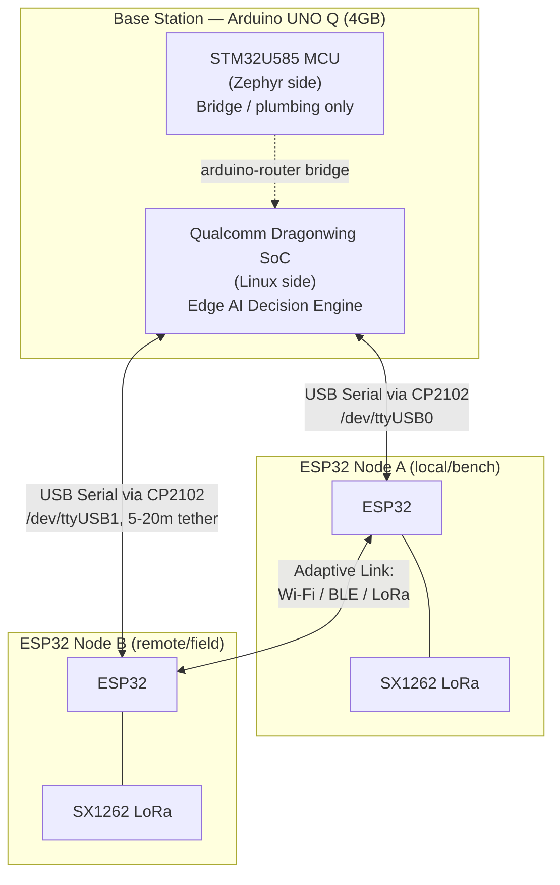

### B. Hardware Block Diagram

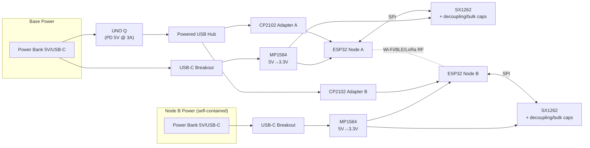

### C. Component Responsibility Matrix

| Component | Primary Responsibility | Not Responsible For |
|---|---|---|
| UNO Q — STM32 MCU (Zephyr) | Real-time GPIO/bridge plumbing | ML inference, RF adaptive link |
| UNO Q — Linux (Dragonwing) | Edge AI inference, telemetry logging, API/dashboard | Real-time RF switching latency path |
| ESP32 Node A / B | RF adaptive link (Wi-Fi/BLE/LoRa), local metric collection, fast-path switching, telemetry reporting | ML training/inference |
| SX1262 module | Physical-layer LoRa TX/RX | Protocol decision logic |

---

## IV. Data Flow Diagrams

### A. Level 0 (Context Diagram)

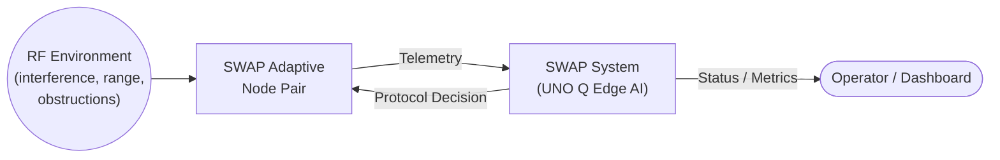

### B. Level 1 (Decomposed)

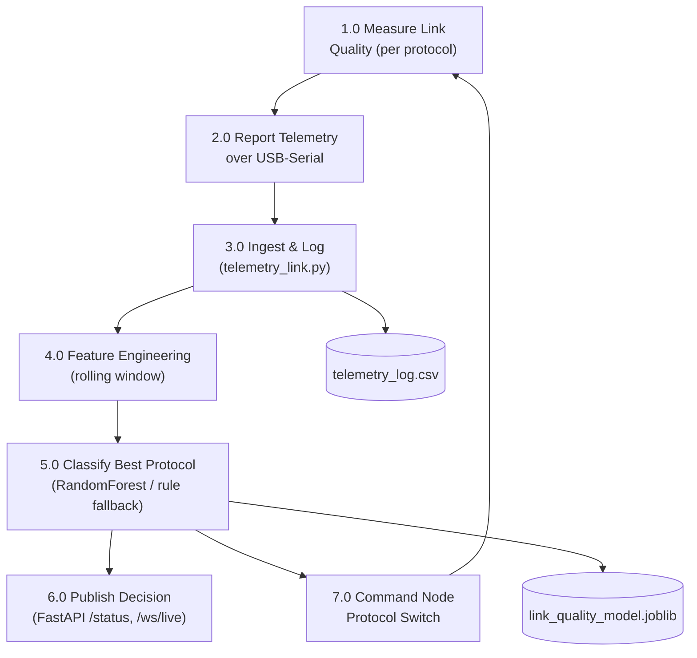

---

## V. UML Diagrams

### A. Use Case Diagram

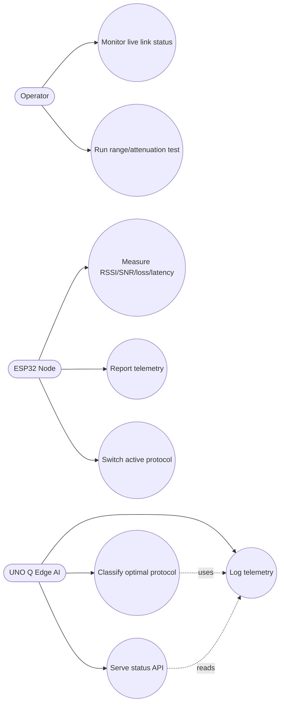

### B. Class Diagram (Firmware + Backend, simplified)

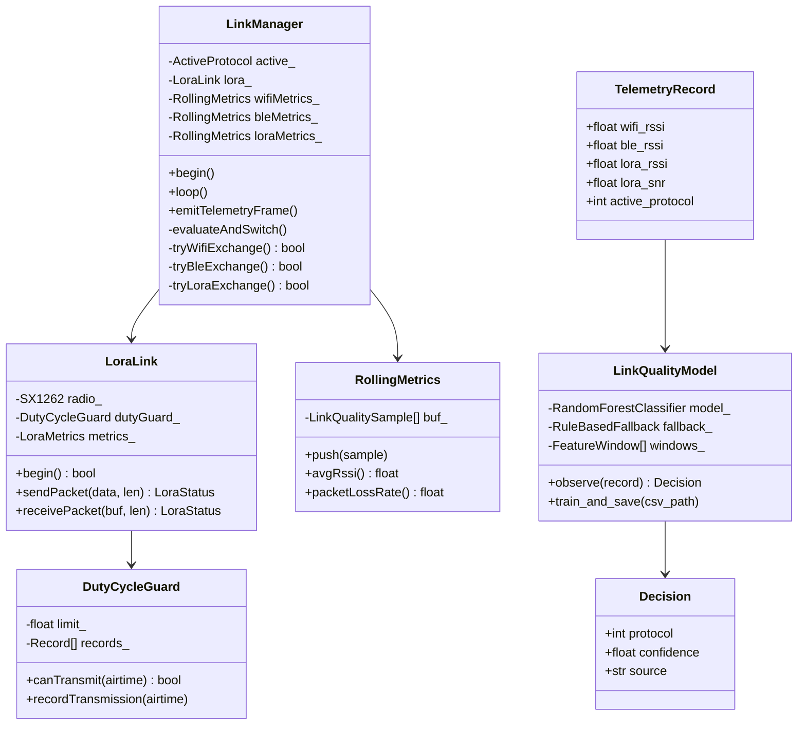

### C. Sequence Diagram — Adaptive Switching + Telemetry Round Trip

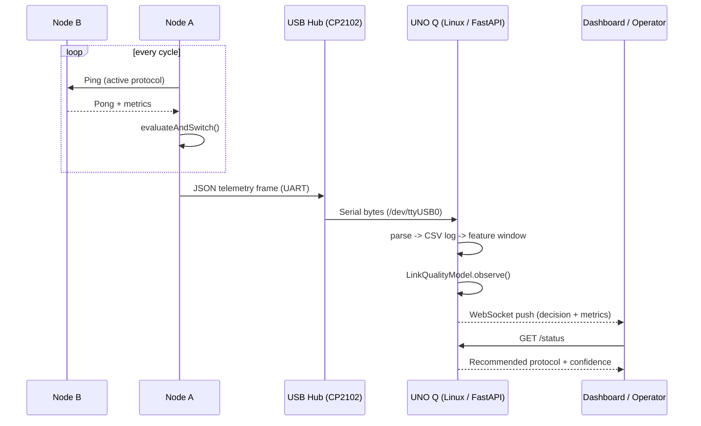

### D. Component Diagram

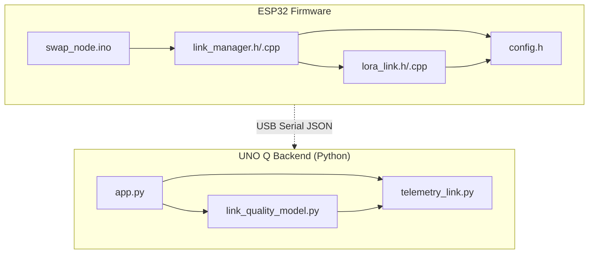

---

## VI. Flowcharts

### A. Protocol-Switching Decision Flowchart (per node, fast path)

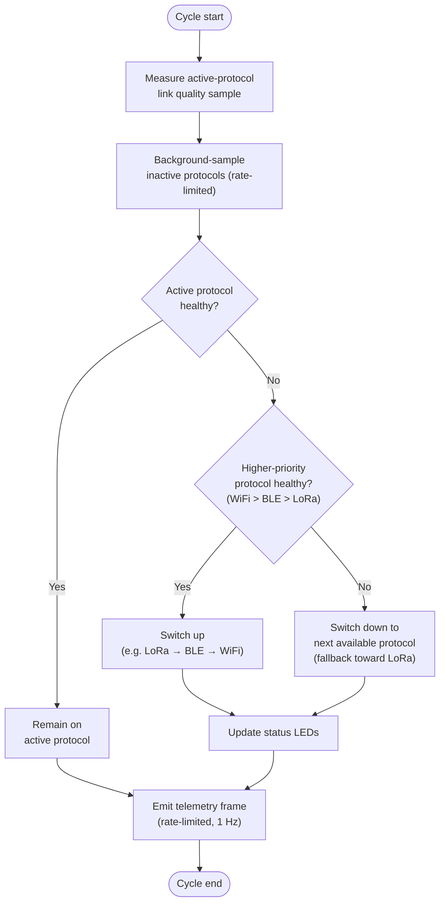

### B. Edge AI Decision Workflow (UNO Q, slow path)

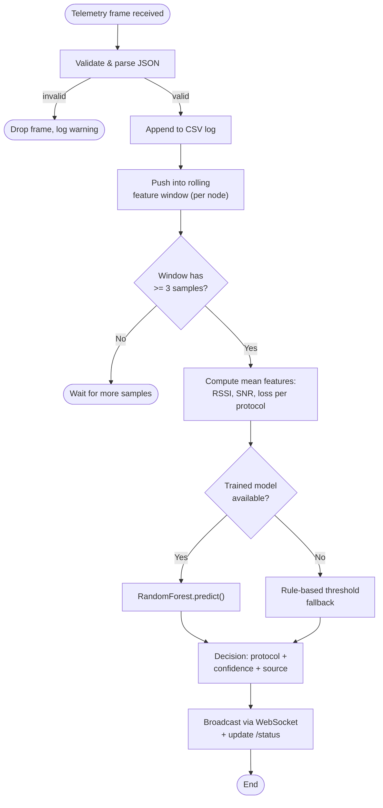

### C. LoRa Duty-Cycle Guard Flowchart (IN865 compliance)

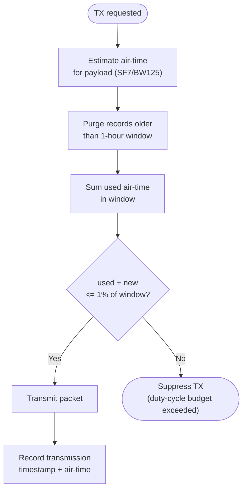

---

## VII. Hardware Design Summary

Full wiring tables, pin maps, and passive-component specifications are provided in **Part II, §6**. Summary:

- All logic is natively 3.3 V (UNO Q Maker I/O, ESP32, SX1262) — no level shifters required.
- SX1262 RXEN/TXEN RF-switch pins are **not internally tied** on the Waveshare Core1262-HF and must be explicitly driven via `RadioLib::setRfSwitchTable()` (Part II §7.2, §11.1).
- Node B is electrically isolated from the base station (own power bank + MP1584); only a shielded twisted-pair UART tether (TX/RX/GND) connects it back to UNO Q, avoiding voltage-drop and ground-loop issues over a 5–20 m run.

---

## VIII. Protocol Comparison

*(Reproduced from Part II §10 for reference within this design document.)*

| Metric | Wi-Fi (2.4 GHz) | BLE | LoRa (IN865) |
|---|---|---|---|
| Range (line-of-sight) | 30–100 m | 10–30 m | 2–15 km |
| Bandwidth | 10s–100s Mbps | ~1 Mbps (effective lower) | ~0.3–50 kbps |
| Latency | Low (ms) | Low–moderate | High (100s ms–s) |
| Power draw | Highest | Moderate | Lowest |
| Interference resilience | Low (2.4 GHz congestion-sensitive) | Moderate | High (spread spectrum) |
| Regulatory constraint | Standard unlicensed 2.4 GHz | Standard unlicensed 2.4 GHz | IN865, ~1% duty cycle |

---

## IX. Machine Learning Methodology

Summarized here; full detail and code in Part II §8–9.

- **Model:** RandomForestClassifier — chosen for low computational cost, explainability (feature importances), and suitability for small tabular datasets on embedded Linux without GPU.
- **Features:** rolling-window means of Wi-Fi RSSI/loss, BLE RSSI, LoRa RSSI/SNR/loss.
- **Fallback:** deterministic rule-based thresholding when no trained model is present, ensuring correct operation before a labeled dataset exists.
- **Evaluation:** stratified 80/20 train/test split, precision/recall/F1 per protocol class; class imbalance (LoRa-optimal windows likely rarer in bench testing) is a known risk to monitor.

---

## X. Testing Strategy & Current Status

See Part II §12 for the full phase-by-phase status table. In IEEE-report terms, testing follows a **bottom-up integration strategy**:

1. Unit level — per-radio point-to-point bring-up (LoRa ✅, Wi-Fi ✅, BLE 🟡 in progress).
2. Electrical validation — rail voltage/current verification (⏳ pending).
3. Interface level — USB-serial enumeration, UNO Q ↔ node telemetry (❌ blocked on powered USB hub).
4. System level — protocol-switching logic validation, then ML decision-engine validation against labeled range-test data.
5. Full integration — failure-mode and demo-condition testing (walls, congestion, distance sweeps).

---

## XI. Conclusion & Future Work

SWAP demonstrates that a resource-constrained edge platform (Arduino UNO Q) can host a real-time-adjacent, explainable Edge AI decision engine capable of arbitrating between three physically distinct radio technologies, without requiring cloud connectivity or GPU acceleration. The two-tier design — fast local switching on the ESP32 pair, slower pattern-level correction from the Linux-side model — balances reaction latency against inference sophistication. Planned future work (Part II §14) includes on-node TinyML distillation, real power-budget instrumentation (INA219/INA226), and a live operator dashboard.

---

## XII. References

1. Arduino, *"Arduino UNO Q Datasheet,"* ABX00162/ABX00173.
2. Semtech, *"SX1262 LoRa Transceiver Datasheet."*
3. Waveshare, *"Core1262-HF LoRa Module Documentation."*
4. jgromes, *"RadioLib,"* GitHub repository.
5. Government of India, Wireless Planning & Coordination (WPC) Wing, *"IN865 De-Licensed Band Regulations."*
6. Espressif Systems, *"ESP32 Technical Reference Manual."*
7. F. Pedregosa et al., *"Scikit-learn: Machine Learning in Python,"* JMLR, 2011.

---

# Part II — Full Technical Reference

> Everything below is the complete engineering reference: bill of materials, wiring/pin tables, power architecture, full firmware source, full backend source, known issues, and the architecture decision log. Part I above is the summarized, diagram-driven design document derived from this material.

## Table of Contents

1. [System Overview](#1-system-overview)
2. [Architecture](#2-architecture)
2A. [Design Rationale — Architecture Decision Log](#2a-design-rationale--architecture-decision-log)
3. [Regulatory Compliance — IN865](#3-regulatory-compliance--in865)
4. [Bill of Materials](#4-bill-of-materials)
5. [Power Architecture](#5-power-architecture)
6. [Wiring & Pin Mapping](#6-wiring--pin-mapping)
7. [Firmware — ESP32 Nodes (Node A / Node B)](#7-firmware--esp32-nodes-node-a--node-b)
8. [UNO Q Linux-Side Backend (Python)](#8-uno-q-linux-side-backend-python)
9. [Machine Learning — Adaptive Decision Engine](#9-machine-learning--adaptive-decision-engine)
10. [Protocol Comparison](#10-protocol-comparison)
11. [Known Issues & Debugging Notes](#11-known-issues--debugging-notes)
12. [Test Roadmap & Current Status](#12-test-roadmap--current-status)
13. [Demo Preparation](#13-demo-preparation)
14. [Future Improvements](#14-future-improvements)

---

## 1. System Overview

SWAP is a two-tier system:

- **Node A** and **Node B** — two ESP32 DevKit V1 boards, each paired with a Waveshare Core1262-HF (SX1262) LoRa module. These two nodes form the actual RF link under test and continuously negotiate whether to talk over Wi-Fi, Bluetooth (BLE), or LoRa, based on live link-quality metrics (RSSI, SNR, latency, packet loss).
- **UNO Q** — the base station "brain." It does **not** participate in the adaptive RF link itself. It receives telemetry from Node A over a wired UART/USB-serial tether, runs the ML inference (interference/link-quality classification) on its **Linux (Qualcomm Dragonwing) side**, logs data, and can push tuning parameters back down.

```
                         ┌─────────────────────────────┐
                         │        Arduino UNO Q         │
                         │  ┌───────────┐ ┌───────────┐ │
                         │  │ STM32 MCU │ │  Linux /   │ │
                         │  │ (Zephyr)  │ │ Dragonwing │ │
                         │  │  plumbing │ │  ML + API  │ │
                         │  └───────────┘ └─────┬─────┘ │
                         └───────────────────────┼───────┘
                                     USB (CP2102) │  USB (CP2102)
                              via powered USB hub │  via powered USB hub
                         ┌───────────────────────┴───────┐
                         │       /dev/ttyUSB0 (Node A)    │
                         │       /dev/ttyUSB1 (Node B)*   │
                         └───────────────────────┬────────┘
                                                  │
        ┌─────────────────────────────┐          │        ┌─────────────────────────────┐
        │           Node A            │◄─────────┴───────►│           Node B            │
        │  ESP32 + SX1262 (Core1262)  │   Wi-Fi / BLE /    │  ESP32 + SX1262 (Core1262)  │
        │  local / bench-side         │   LoRa (adaptive)  │  remote / field-side        │
        └─────────────────────────────┘                    └─────────────────────────────┘
```

\* Node B's USB-TTL tether is a shielded twisted-pair (CAT5e/CAT6) run, TX/RX/GND only — **not power**. Node B carries its own local power bank + MP1584.

**Key architectural facts (locked in):**

- UNO Q's MCU-side `Serial1` is exclusively locked by the `arduino-router` bridge service — it cannot be used for external UART.
- Both nodes connect to UNO Q as **independent USB-serial devices** (`CP2102` USB-TTL adapters through a **powered** USB hub), landing on the **Linux side** as `/dev/ttyUSB0` / `/dev/ttyUSB1`. This sidesteps the Serial1/bridge restriction entirely.
- The ML model runs on the **Linux (Dragonwing) side** of UNO Q, not the STM32/Zephyr side. The MCU side is not used for this pipeline.
- No level shifters are needed anywhere: UNO Q Maker I/O, ESP32 GPIO, and SX1262 modules are all natively 3.3 V.

---

## 2. Architecture

### 2.1 Roles

| Component | Role | Connectivity |
|---|---|---|
| UNO Q | Base station: telemetry logging, ML inference, control/monitoring API | 2× CP2102 USB-TTL → powered USB hub → USB-C on UNO Q |
| Node A | Local/bench-side adaptive node | Wi-Fi + BLE + LoRa to Node B; UART tether (short) to Adapter A |
| Node B | Remote/field-side adaptive node | Wi-Fi + BLE + LoRa to Node A; UART tether (5–20 m shielded) to Adapter B |

### 2.2 Data Flow

```
[Node B RF metrics] --LoRa/WiFi/BLE--> [Node A] --UART--> [CP2102 Adapter A] --USB--> [UNO Q Linux]
[Node A RF metrics] ------------------------------------------------------------------> [UNO Q Linux]
                                                                                              │
                                                                                    ┌─────────▼─────────┐
                                                                                    │ telemetry_link.py  │
                                                                                    │  (serial ingest)   │
                                                                                    └─────────┬─────────┘
                                                                                    ┌─────────▼─────────┐
                                                                                    │link_quality_model.py│
                                                                                    │ (feature eng. + ML) │
                                                                                    └─────────┬─────────┘
                                                                                    ┌─────────▼─────────┐
                                                                                    │      app.py         │
                                                                                    │  (FastAPI: /status,  │
                                                                                    │   /telemetry, /ws)   │
                                                                                    └─────────────────────┘
```

Each node independently measures its own link-quality metrics per protocol and reports them; the switching **decision** for the Node A↔Node B link can be made locally on the ESP32 pair (fast path, sub-second reaction) and is *logged and optionally overridden* by the ML model running on UNO Q (slow path, pattern/interference detection across a longer time window). This two-tier design avoids putting the UART/USB round-trip latency into the critical switching path.

### 2.3 Mermaid — Adaptive Switching State Machine

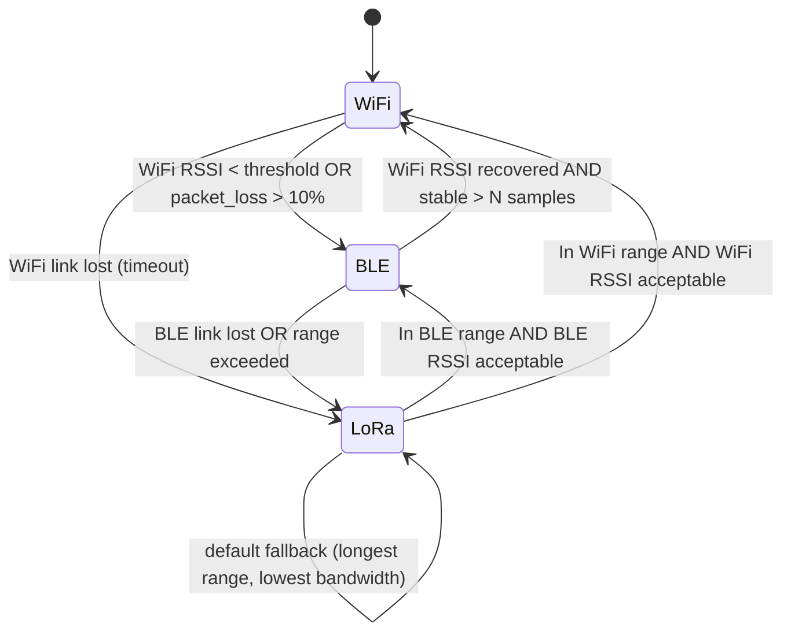

---

## 2A. Design Rationale — Architecture Decision Log

*This section preserves the reasoning trail behind the final architecture — useful for the report/publication write-up and for onboarding teammates who weren't in the original design discussions. The physical implementation details (CP2102 adapters, powered USB hub, etc.) described elsewhere in this document are how the "UART" link referenced below is actually realized — see §6.1 and the note at the end of this section.*

### Project Objective

Develop an Adaptive Communication Protocol capable of dynamically selecting the most suitable wireless communication technology based on real-time network conditions. The protocols under consideration are **Wi-Fi (2.4 GHz)**, **Bluetooth 4.2**, and **LoRa (SX1262)**. Protocol selection is performed using an **Edge AI model running on the Arduino UNO Q (4GB)**.

### Problem Statement

Traditional wireless systems depend on a single communication technology (Wi-Fi only, Bluetooth only, or LoRa only). If that method experiences high interference, packet loss, increased latency, or poor RSSI, the entire communication system degrades. This project solves that by letting the protocol switch automatically, driven by AI.

### Idea 1 — Fully wired control network

```
UNO Q
  │
  ├── UART → ESP32 Node 1
  │
  └── UART → ESP32 Node 2
```

Technically correct, but it invites an obvious objection: *if every node is already wired to the controller, why not simply wire the entire system with Ethernet?* This weakens the demonstration, since the project's goal is to solve a **wireless** communication problem.

### Idea 2 — One wired node, one wireless node

```
UNO Q
  │
  ├── UART → Node 1
  │
  └── Wi-Fi → Node 2
```

Better reflects real deployments (one tethered/local unit, one field/remote unit). But it raised a new concern: the ESP32 already uses Wi-Fi for both the adaptive link *and* communication with the UNO Q — would the onboard Wi-Fi radio become overloaded doing double duty?

### Idea 3 — Dedicated ESP8266 for telemetry

```
ESP32
  │
  ├── Wi-Fi (Adaptive)
  ├── Bluetooth
  ├── LoRa
  │
  └── ESP8266
        │
      Wi-Fi
        │
      UNO Q
```

Purpose: use the ESP8266 exclusively for telemetry back to UNO Q, freeing the ESP32's Wi-Fi radio for the adaptive link only.

**Analysis:**

| | |
|---|---|
| **Advantages** | Dedicated Wi-Fi interface; clean separation between telemetry and adaptive communication |
| **Disadvantages** | Additional firmware to write/maintain; additional debugging surface; higher power consumption; an extra UART hop; more synchronization complexity; larger hardware footprint; an additional failure point |

**Conclusion:** the ESP8266 does not provide enough benefit to justify the added complexity. **Not recommended for Version 1.**

### ESP-NOW — considered and rejected

ESP-NOW was evaluated as a lightweight alternative to UART/Wi-Fi-AP telemetry.

**Advantages:** very low latency, lightweight protocol, no Wi-Fi router required, excellent for telemetry.

**Why it doesn't work here:** ESP-NOW is an Espressif-proprietary protocol. The Arduino UNO Q uses Qualcomm networking hardware, so `ESP32 ← ESP-NOW → UNO Q` is **not supported** — ESP-NOW only works between compatible Espressif devices (ESP32↔ESP32, ESP32↔ESP8266, etc.). It therefore cannot replace the UNO Q↔ESP32 telemetry link.

### Final Architecture (confirmed)

```
                    Arduino UNO Q (4GB)
                 Edge AI Decision Engine
                         │
          ┌──────────────┴──────────────┐
          │                             │
       UART                          UART
          │                             │
     ESP32 Node 1                 ESP32 Node 2
          │                             │
     Wi-Fi                        Wi-Fi
     Bluetooth                    Bluetooth
     LoRa                         LoRa
          │                             │
          └──────── Adaptive Link ──────┘
             Wi-Fi / Bluetooth / LoRa
```

**Two communication layers:**

- **Layer 1 — Internal Control Network** (`UNO Q ↔ UART ↔ ESP32`): telemetry, AI decisions, logging. Not itself part of the research contribution — it's plumbing.
- **Layer 2 — Adaptive Communication Network** (`Node 1 ↔ Wi-Fi/BLE/LoRa ↔ Node 2`): the actual contribution of the project — this is what's being demonstrated.

### AI Workflow

1. **Measure** — each ESP32 measures RSSI, packet loss, latency, battery, and relevant sensor data.
2. **Report** — telemetry is sent to UNO Q, e.g. `RSSI = -71 dBm, Latency = 12 ms, Packet Loss = 2%, Battery = 87%, Obstacle = TRUE`.
3. **Decide** — UNO Q runs the Edge AI model. Input: RSSI, packet loss, latency, battery, distance, confidence. Output: `Wi-Fi` / `Bluetooth` / `LoRa`.
4. **Act** — UNO Q instructs the ESP32 nodes to switch protocol.

### AI Model Choice

**Version 1:** Decision Tree or Random Forest — fast inference, explainable, lightweight, easy to train, well suited to embedded Edge AI. (This matches the RandomForestClassifier choice detailed in §9.)

**Future versions:** TinyML, TensorFlow Lite, or neural network approaches once a larger labeled dataset exists.

### Final Decision

**Keep:** Arduino UNO Q as the Edge AI brain; two ESP32 nodes; Wi-Fi, Bluetooth, and LoRa as the adaptive protocol set.

**Do not add:** ESP8266 or any extra Wi-Fi module. The ESP32 already supports simultaneous wireless communication efficiently — adding another MCU increases system complexity without significant practical benefit.

**No additional hardware is required** beyond what's already listed in §4 (Bill of Materials).

### Future Improvements (Version 2)

- CAN Bus instead of UART for the control network
- GPS module
- TinyML / TensorFlow Lite on-node inference
- Web dashboard
- OLED status display
- Network performance graphs
- AI confidence visualization
- OTA firmware updates

### Note on "UART" vs. the CP2102/USB implementation

The Layer 1 diagram above describes the control network at the architecture level as `UNO Q ↔ UART ↔ ESP32`. The concrete hardware realization of that link — worked out during hardware bring-up — is **not** a raw GPIO UART: UNO Q's MCU-side `Serial1` is locked by the `arduino-router` bridge service, so each ESP32 node instead connects as an independent **USB-serial device** (CP2102 USB-TTL adapter → powered USB hub → UNO Q's **Linux** side, appearing as `/dev/ttyUSB0` / `/dev/ttyUSB1`). Electrically and logically this is still a UART link end-to-end (the ESP32's UART2 pins TX/RX feed into the CP2102, which presents it to Linux as a serial port) — it's the same Layer 1 concept as this design rationale describes, just routed around the Serial1/bridge restriction. See §6.1 and §11.5 for the full technical detail.

---

## 3. Regulatory Compliance — IN865

- **433 MHz is non-compliant** for standard LoRa use in India: the WPC/DoT allocation there caps channel bandwidth at 10 kHz, well below the 125 kHz minimum LoRa needs to operate normally.
- **IN865 (865–867 MHz)** is the correct license-exempt band, subject to ~1% duty cycle as a safe default (no formal LBT/AFA mandate at low power, but low duty cycle is the conservative norm used here).
- Modules commonly sold as "868 MHz" (EU863-870 band) are **firmware-tunable** down to **866.0 MHz**, which is the project's target frequency — no hardware change required, only a `setFrequency()` call in firmware.
- **Duty cycle enforcement is implemented in firmware** (see `DutyCycleGuard` in the Node firmware below) so demo/test runs cannot accidentally violate the license-exempt terms.

---

## 4. Bill of Materials

### 4.1 Core Compute / Radio

| Item | Spec | Qty | Status |
|---|---|---|---|
| Arduino UNO Q | 4 GB, ABX00173 | 1 | ✅ In hand |
| ESP32 DevKit V1 | 38-pin | 2 | ✅ In hand |
| Waveshare Core1262-HF | SX1262, 850–930 MHz | 2 | ✅ Delivered |
| Ebyte TX900-FPC-4420 | 868/915 MHz IPEX antenna | 2 | ✅ Delivered |

### 4.2 Power

| Item | Spec | Qty | Status |
|---|---|---|---|
| MP1584 buck converter | 5 V → 3.3 V, adjustable, 3 A | 2 | 🟡 Ordered/processing |
| USB-C power breakout (SmartElex or equiv.) | 5 V/3 A PD trigger | 2 | Confirm qty |
| Power bank | 5 V/USB-C, PD 5 V @ 3 A capable | 2 | Node A can share UNO Q's; Node B needs its own |
| Schottky diode | SS34 (3 A/40 V) or 1N5819, reverse-polarity protection | 2 | To order |

### 4.3 Connectivity / Debug

| Item | Spec | Qty | Status |
|---|---|---|---|
| Powered USB hub | USB-C, 2+ USB-A ports, own power input (**not** bus-powered) | 1 | ❌ **Blocking** — not yet available |
| CP2102 USB-TTL adapter | 6-pin, 3.3 V/5 V select jumper → set to 3.3 V | 2 | To confirm |
| Shielded twisted-pair tether cable | CAT5e/CAT6, 2 pairs used (TX+GND, RX+GND) | 1 (sized to test distance) | To source |

### 4.4 Passives (per LoRa module — ×2 sets)

| Item | Spec | Qty per node |
|---|---|---|
| Decoupling cap | 100 nF ceramic, X7R | 1 |
| Bulk/reservoir cap | 100–470 µF electrolytic, 10 V+ | 1 |
| MP1584 output smoothing cap | 100 µF electrolytic | 1 |

### 4.5 Build Materials

Perfboard (5×7 or 7×9 cm, ×2–3), 2.54 mm female header strips, 24–26 AWG signal wire, 20–22 AWG silicone power wire, heat shrink, Dupont jumpers (M-M/M-F), multimeter, solder + flux.

### 4.6 Optional / Under Consideration

| Item | Purpose |
|---|---|
| INA219 / INA226 current sensor (I2C, Qwiic) | Real power measurement if a "Battery Level"/low-power mode is implemented |
| 2-pin JST-PH pigtail on MP1584 output | Hot-swap LoRa module replacement during live demos — flagged, not yet confirmed purchased |
| Status LEDs (2–3 per node) + 220–330 Ω resistors | Visual indicator of active protocol, useful when Node B is out of USB range |
| Small project enclosure (~100×70×40 mm) | Protect Node B electronics during outdoor range testing |

> **Note on Wi-Fi HaLow:** a Seeed Studio Wi-Fi HaLow transceiver (FGH100M-H, 902–928 MHz, IEEE 802.11ah, up to 1 km range) was reviewed as a reference/alternative. It is **not** part of the confirmed SWAP architecture (SWAP uses standard 2.4 GHz Wi-Fi + BLE + IN865 LoRa) and is **not compliant with the IN865 target band** (902–928 MHz overlaps India's other ISM allocations, not IN865) — keep it as a "future direction" reference only, not a current BOM item.

---

## 5. Power Architecture

Rejected design: powering Node B over the tether cable (12 V boosted line + local buck) — this was **Option B**, rejected in favor of full self-containment.

**Confirmed design:**

```
Base station:
  Power bank (5V/USB-C) ──USB-C PD──> UNO Q (5V @ 3A)
  Power bank (5V/USB-C) ──> USB-C breakout ──> MP1584 (5V→3.3V) ──> Node A ESP32 + SX1262

Node B (fully self-contained):
  Local power bank (5V/USB-C) ──> USB-C breakout ──> MP1584 (5V→3.3V) ──> Node B ESP32 + SX1262

Tether cable (Node B <-> UNO Q, via Adapter B):
  Shielded twisted-pair, TX/RX/GND ONLY — telemetry, not power
```

**Why this wins:** ground-loop safety (isolated power banks, only signal ground shared over the tether), no voltage-drop engineering problem over a 5–20 m run, and it future-proofs Node B for a fully wireless-standalone mode later (just unplug the tether).

---

## 6. Wiring & Pin Mapping

### 6.1 Base Station (UNO Q side)

```
UNO Q ──USB-C──> Powered USB Hub ──USB──> CP2102 Adapter A ──TX/RX/GND──> Node A
                                └──USB──> CP2102 Adapter B ──TX/RX/GND──> Node B (via tether)
```

| Adapter | UNO Q Linux device | Connects to |
|---|---|---|
| Adapter A | `/dev/ttyUSB0` | Node A (short bench wiring) |
| Adapter B | `/dev/ttyUSB1` | Node B (5–20 m shielded tether) |

**Adapter-to-node wiring (identical for both, 3 wires only):**

| Adapter pin | ESP32 pin | Note |
|---|---|---|
| TXD | GPIO16 (RX2) | Crossed |
| RXD | GPIO17 (TX2) | Crossed |
| GND | GND | Shared reference |
| VCC/5V | **Not connected** | Node is powered independently — never back-feed |

> Set every CP2102 jumper to **3.3 V** before connecting. ESP32 UART pins are not 5 V-tolerant.

### 6.2 ESP32 ↔ SX1262 (Waveshare Core1262-HF) — identical for Node A and Node B

| Core1262-HF pin | ESP32 GPIO | Function |
|---|---|---|
| VCC | 3.3V (via MP1584, **not** ESP32 onboard reg) | Power |
| GND | GND | Ground |
| MOSI | GPIO23 | SPI |
| MISO | GPIO19 | SPI |
| SCK | GPIO18 | SPI |
| NSS (CS) | GPIO5 | SPI chip select |
| RESET | GPIO14 (or **GPIO33** if boot issues occur — GPIO12 is a strapping pin, avoid) | Module reset |
| DIO1 (IRQ) | GPIO26 | TX/RX done interrupt |
| BUSY | GPIO27 | RadioLib busy line |
| RXEN | GPIO25 | **Must be driven explicitly** — not internally tied on this module |
| TXEN | GPIO32 | **Must be driven explicitly** — not internally tied on this module |

> **Critical gotcha:** unlike some SX1262 breakouts, the Waveshare Core1262-HF's RXEN/TXEN RF-switch control lines are **not** internally wired to the radio automatically — RadioLib's `setRfSwitchTable()` must be used, or TX will report success while RX silently receives nothing (this was the exact bug hit during loopback bring-up — see [§11](#11-known-issues--debugging-notes)).

### 6.3 Power Rail Summary (per node)

```
Power bank (5V) ─┬─> USB-C breakout ─> ESP32 5V/VIN
                  └─> MP1584 (5V→3.3V, verify with multimeter BEFORE connecting load)
                        ├─> SX1262 VCC (+ 100nF decoupling at pin, + 100–470µF bulk cap)
                        └─> (LEDs, status indicators via resistor)
```

---

## 7. Firmware — ESP32 Nodes (Node A / Node B)

Both nodes run the **same firmware image**; role is selected at compile time. This also embeds the `SWAP_ROLES` toggle used to isolate the RXEN/TXEN loopback bug without rewiring (see §11).

Split across four files for maintainability. Create an Arduino sketch folder `swap_node/` with these files:

### 7.1 `swap_node/config.h`

```cpp
#pragma once
// ============================================================
//  SWAP Node Configuration
//  Same firmware flashed to both ESP32 nodes — role selected here.
// ============================================================

// ---- Role selection --------------------------------------------------
// Set exactly one to 1. NODE_ROLE_A = local/bench node, NODE_ROLE_B = remote/field node.
#define NODE_ROLE_A 1
#define NODE_ROLE_B 0

#if (NODE_ROLE_A + NODE_ROLE_B) != 1
#error "Exactly one of NODE_ROLE_A / NODE_ROLE_B must be set to 1"
#endif

// ---- Diagnostic toggle -------------------------------------------------
// Introduced to isolate the RXEN/TXEN RX-silent bug: swaps which node
// transmits first in loopback test mode without touching wiring.
// Leave at 0 for normal adaptive operation.
#define SWAP_ROLES 0

// ---- SPI / SX1262 pin map (identical wiring on both nodes) ------------
#define LORA_NSS_PIN    5
#define LORA_RESET_PIN  14      // fallback: 33 if boot issues (GPIO12 is a strapping pin)
#define LORA_BUSY_PIN   27
#define LORA_DIO1_PIN   26
#define LORA_RXEN_PIN   25      // MUST be explicitly driven — not internally tied
#define LORA_TXEN_PIN   32      // MUST be explicitly driven — not internally tied

#define SPI_MOSI_PIN    23
#define SPI_MISO_PIN    19
#define SPI_SCK_PIN     18

// ---- UART link to UNO Q (via CP2102 adapter) ---------------------------
#define TELEMETRY_SERIAL      Serial2
#define TELEMETRY_TX_PIN      17   // ESP32 TX2 -> Adapter RXD
#define TELEMETRY_RX_PIN      16   // ESP32 RX2 -> Adapter TXD
#define TELEMETRY_BAUD        19200   // keep modest for long tether runs (5-10m+)

// ---- LoRa radio parameters (India IN865, tuned from 868MHz hardware) ---
#define LORA_FREQUENCY_MHZ    866.0f
#define LORA_BANDWIDTH_KHZ    125.0f
#define LORA_SPREADING_FACTOR 7
#define LORA_CODING_RATE      5      // 4/5
#define LORA_TX_POWER_DBM     14     // IN865 permits up to 30 dBm EIRP; keep conservative for bench/demo
#define LORA_PREAMBLE_LEN     8

// IN865 duty cycle safety: 1% default. Enforced by DutyCycleGuard in lora_link.h.
#define LORA_DUTY_CYCLE_LIMIT 0.01f

// ---- Wi-Fi (SoftAP + TCP link between the two nodes) --------------------
#define WIFI_SSID        "SWAP_LINK"
#define WIFI_PASSWORD     "swap_secure_pass"   // change before real deployment
#define WIFI_TCP_PORT     5000
#define WIFI_CONNECT_TIMEOUT_MS  6000

// ---- BLE ------------------------------------------------------------
#define BLE_DEVICE_NAME        "SWAP_NODE"
#define BLE_SERVICE_UUID        "6e400001-b5a3-f393-e0a9-e50e24dcca9e"
#define BLE_CHAR_TX_UUID        "6e400002-b5a3-f393-e0a9-e50e24dcca9e"
#define BLE_CHAR_RX_UUID        "6e400003-b5a3-f393-e0a9-e50e24dcca9e"
// Open question (per project notes): connection interval to test before
// finalizing firmware. Start at 15ms (fast, higher power); fall back to
// 45-75ms for a lower-power / higher-latency profile if needed.
#define BLE_MIN_CONN_INTERVAL   12   // *1.25ms units => 15ms
#define BLE_MAX_CONN_INTERVAL   12

// ---- Link-quality thresholds driving the switching state machine -------
#define WIFI_RSSI_MIN_DBM       -75
#define WIFI_PACKET_LOSS_MAX    0.10f   // 10%
#define BLE_RSSI_MIN_DBM        -85
#define METRIC_WINDOW_SAMPLES    10
#define LINK_TIMEOUT_MS          2000

// ---- Status LEDs (optional) -------------------------------------------
#define LED_WIFI_PIN   4
#define LED_BLE_PIN    2
#define LED_LORA_PIN   15
```

### 7.2 `swap_node/lora_link.h` / `.cpp`

```cpp
// lora_link.h
#pragma once
#include <RadioLib.h>
#include "config.h"

enum class LoraStatus { OK, TX_FAIL, RX_TIMEOUT, RX_CRC_ERROR, NOT_READY };

struct LoraMetrics {
    float rssi_dbm = 0;
    float snr_db = 0;
    uint32_t packets_sent = 0;
    uint32_t packets_lost = 0;
    uint32_t last_rtt_ms = 0;
};

class DutyCycleGuard {
public:
    explicit DutyCycleGuard(float limit_fraction) : limit_(limit_fraction) {}

    // Call before every TX. Returns false if transmitting now would exceed
    // the configured duty cycle over the trailing 1-hour window.
    bool canTransmit(uint32_t next_tx_air_time_ms) {
        purgeOld();
        uint32_t used = airtimeUsedMs();
        uint32_t budget = static_cast<uint32_t>(WINDOW_MS * limit_);
        return (used + next_tx_air_time_ms) <= budget;
    }

    void recordTransmission(uint32_t air_time_ms) {
        if (count_ < MAX_RECORDS) {
            records_[count_].timestamp_ms = millis();
            records_[count_].air_time_ms = air_time_ms;
            count_++;
        }
    }

private:
    static constexpr uint32_t WINDOW_MS = 3600000UL; // 1 hour
    static constexpr size_t MAX_RECORDS = 256;
    struct Record { uint32_t timestamp_ms; uint32_t air_time_ms; };
    Record records_[MAX_RECORDS];
    size_t count_ = 0;
    float limit_;

    void purgeOld() {
        uint32_t now = millis();
        size_t write = 0;
        for (size_t i = 0; i < count_; i++) {
            if (now - records_[i].timestamp_ms < WINDOW_MS) {
                records_[write++] = records_[i];
            }
        }
        count_ = write;
    }

    uint32_t airtimeUsedMs() {
        uint32_t total = 0;
        for (size_t i = 0; i < count_; i++) total += records_[i].air_time_ms;
        return total;
    }
};

class LoraLink {
public:
    bool begin();
    LoraStatus sendPacket(const uint8_t* data, size_t len);
    LoraStatus receivePacket(uint8_t* buf, size_t buf_len, size_t& received_len, uint32_t timeout_ms);
    const LoraMetrics& metrics() const { return metrics_; }

private:
    SPIClass loraSPI_{HSPI};
    Module* module_ = nullptr;
    SX1262* radio_ = nullptr;
    LoraMetrics metrics_;
    DutyCycleGuard dutyGuard_{LORA_DUTY_CYCLE_LIMIT};

    void configureRfSwitch();
    uint32_t estimateAirTimeMs(size_t payload_len) const;
};
```

```cpp
// lora_link.cpp
#include "lora_link.h"

bool LoraLink::begin() {
    loraSPI_.begin(SPI_SCK_PIN, SPI_MISO_PIN, SPI_MOSI_PIN, LORA_NSS_PIN);

    module_ = new Module(LORA_NSS_PIN, LORA_DIO1_PIN, LORA_RESET_PIN, LORA_BUSY_PIN, loraSPI_);
    radio_ = new SX1262(module_);

    int state = radio_->begin(
        LORA_FREQUENCY_MHZ,
        LORA_BANDWIDTH_KHZ,
        LORA_SPREADING_FACTOR,
        LORA_CODING_RATE,
        RADIOLIB_SX126X_SYNC_WORD_PRIVATE,
        LORA_TX_POWER_DBM,
        LORA_PREAMBLE_LEN
    );

    if (state != RADIOLIB_ERR_NONE) {
        Serial.printf("[LoRa] init failed, code %d\n", state);
        return false;
    }

    // CRITICAL: Waveshare Core1262-HF does not internally tie RXEN/TXEN.
    // Without this, TX reports success but RX receives nothing (root cause
    // of the loopback bug logged during bring-up — see project notes §11).
    configureRfSwitch();

    Serial.println("[LoRa] init OK, freq=866.0MHz (IN865)");
    return true;
}

void LoraLink::configureRfSwitch() {
    pinMode(LORA_RXEN_PIN, OUTPUT);
    pinMode(LORA_TXEN_PIN, OUTPUT);

    static const RadioLibSwitchMode_t rfSwitchTable[] = {
        {Module::MODE_IDLE,  {LOW,  LOW}},
        {Module::MODE_RX,    {HIGH, LOW}},
        {Module::MODE_TX,    {LOW,  HIGH}},
        RADIOLIB_SX126X_MODE_TABLE_END
    };
    const uint32_t pins[2] = {LORA_RXEN_PIN, LORA_TXEN_PIN};
    radio_->setRfSwitchTable(pins, rfSwitchTable);
}

uint32_t LoraLink::estimateAirTimeMs(size_t payload_len) const {
    // Rough SF7/BW125 estimate; sufficient for duty-cycle budgeting, not
    // a certified regulatory air-time calculator.
    float symbol_time_ms = (1 << LORA_SPREADING_FACTOR) / LORA_BANDWIDTH_KHZ;
    float n_symbols = 8.0f + max(0.0f, ceilf((8.0f * payload_len - 4.0f * LORA_SPREADING_FACTOR + 28.0f + 16.0f)
                                / (4.0f * LORA_SPREADING_FACTOR)) * (LORA_CODING_RATE));
    return static_cast<uint32_t>((LORA_PREAMBLE_LEN + 4.25f + n_symbols) * symbol_time_ms);
}

LoraStatus LoraLink::sendPacket(const uint8_t* data, size_t len) {
    uint32_t air_time = estimateAirTimeMs(len);
    if (!dutyGuard_.canTransmit(air_time)) {
        Serial.println("[LoRa] duty-cycle budget exceeded, TX suppressed");
        return LoraStatus::TX_FAIL;
    }

    uint32_t start = millis();
    int state = radio_->transmit(data, len);
    metrics_.last_rtt_ms = millis() - start;

    if (state == RADIOLIB_ERR_NONE) {
        metrics_.packets_sent++;
        dutyGuard_.recordTransmission(air_time);
        return LoraStatus::OK;
    }
    metrics_.packets_lost++;
    Serial.printf("[LoRa] TX failed, code %d\n", state);
    return LoraStatus::TX_FAIL;
}

LoraStatus LoraLink::receivePacket(uint8_t* buf, size_t buf_len, size_t& received_len, uint32_t timeout_ms) {
    int state = radio_->receive(buf, buf_len);
    received_len = radio_->getPacketLength();

    if (state == RADIOLIB_ERR_NONE) {
        metrics_.rssi_dbm = radio_->getRSSI();
        metrics_.snr_db = radio_->getSNR();
        return LoraStatus::OK;
    } else if (state == RADIOLIB_ERR_RX_TIMEOUT) {
        return LoraStatus::RX_TIMEOUT;
    } else if (state == RADIOLIB_ERR_CRC_MISMATCH) {
        return LoraStatus::RX_CRC_ERROR;
    }
    return LoraStatus::NOT_READY;
}
```

### 7.3 `swap_node/link_manager.h` / `.cpp` — the adaptive switching core

```cpp
// link_manager.h
#pragma once
#include <Arduino.h>
#include <WiFi.h>
#include <NimBLEDevice.h>
#include "config.h"
#include "lora_link.h"

enum class ActiveProtocol : uint8_t { WIFI = 0, BLE = 1, LORA = 2 };

struct LinkQualitySample {
    float rssi_dbm;
    float snr_db;        // LoRa only, else 0
    uint32_t rtt_ms;
    bool packet_ok;
};

class RollingMetrics {
public:
    void push(const LinkQualitySample& s) {
        buf_[head_] = s;
        head_ = (head_ + 1) % METRIC_WINDOW_SAMPLES;
        if (count_ < METRIC_WINDOW_SAMPLES) count_++;
    }
    float avgRssi() const {
        if (count_ == 0) return -999.0f;
        float sum = 0;
        for (uint8_t i = 0; i < count_; i++) sum += buf_[i].rssi_dbm;
        return sum / count_;
    }
    float packetLossRate() const {
        if (count_ == 0) return 1.0f;
        uint8_t lost = 0;
        for (uint8_t i = 0; i < count_; i++) if (!buf_[i].packet_ok) lost++;
        return static_cast<float>(lost) / count_;
    }
    uint8_t sampleCount() const { return count_; }

private:
    LinkQualitySample buf_[METRIC_WINDOW_SAMPLES] = {};
    uint8_t head_ = 0;
    uint8_t count_ = 0;
};

class LinkManager {
public:
    void begin();
    void loop();
    ActiveProtocol currentProtocol() const { return active_; }
    void emitTelemetryFrame();  // sends JSON line over TELEMETRY_SERIAL

private:
    ActiveProtocol active_ = ActiveProtocol::WIFI;
    LoraLink lora_;
    RollingMetrics wifiMetrics_, bleMetrics_, loraMetrics_;
    uint32_t lastLinkActivity_ms_ = 0;
    NimBLEServer* bleServer_ = nullptr;
    NimBLECharacteristic* bleTxChar_ = nullptr;
    WiFiServer wifiTcpServer_{WIFI_TCP_PORT};
    WiFiClient wifiClient_;

    void beginWifi();
    void beginBle();
    bool tryWifiExchange();
    bool tryBleExchange();
    bool tryLoraExchange();
    void evaluateAndSwitch();
    void setActiveProtocolLed(ActiveProtocol p);
};
```

```cpp
// link_manager.cpp
#include "link_manager.h"
#include <ArduinoJson.h>

void LinkManager::begin() {
    pinMode(LED_WIFI_PIN, OUTPUT);
    pinMode(LED_BLE_PIN, OUTPUT);
    pinMode(LED_LORA_PIN, OUTPUT);

    TELEMETRY_SERIAL.begin(TELEMETRY_BAUD, SERIAL_8N1, TELEMETRY_RX_PIN, TELEMETRY_TX_PIN);

    if (!lora_.begin()) {
        Serial.println("[LinkManager] FATAL: LoRa init failed");
    }

    beginWifi();
    beginBle();

    setActiveProtocolLed(active_);
    lastLinkActivity_ms_ = millis();
}

void LinkManager::beginWifi() {
#if NODE_ROLE_A
    // Node A hosts the SoftAP; Node B connects as a station.
    WiFi.mode(WIFI_AP);
    WiFi.softAP(WIFI_SSID, WIFI_PASSWORD);
    wifiTcpServer_.begin();
    Serial.printf("[WiFi] SoftAP up, IP=%s\n", WiFi.softAPIP().toString().c_str());
#else
    WiFi.mode(WIFI_STA);
    WiFi.begin(WIFI_SSID, WIFI_PASSWORD);
    uint32_t start = millis();
    while (WiFi.status() != WL_CONNECTED && millis() - start < WIFI_CONNECT_TIMEOUT_MS) {
        delay(200);
    }
    if (WiFi.status() == WL_CONNECTED) {
        Serial.printf("[WiFi] STA connected, IP=%s\n", WiFi.localIP().toString().c_str());
    } else {
        Serial.println("[WiFi] STA connect timed out — will retry lazily during switching");
    }
#endif
}

void LinkManager::beginBle() {
    NimBLEDevice::init(BLE_DEVICE_NAME);
    NimBLEDevice::setPower(ESP_PWR_LVL_P9);

#if NODE_ROLE_A
    bleServer_ = NimBLEDevice::createServer();
    NimBLEService* svc = bleServer_->createService(BLE_SERVICE_UUID);
    bleTxChar_ = svc->createCharacteristic(BLE_CHAR_TX_UUID, NIMBLE_PROPERTY::NOTIFY);
    svc->createCharacteristic(BLE_CHAR_RX_UUID, NIMBLE_PROPERTY::WRITE);
    svc->start();
    NimBLEAdvertising* adv = NimBLEDevice::getAdvertising();
    adv->addServiceUUID(BLE_SERVICE_UUID);
    adv->start();
    Serial.println("[BLE] advertising as peripheral (Node A)");
#else
    // Node B scans/connects as central — implementation deferred to the
    // BLE bring-up phase currently in progress (connection-interval
    // sweep: test 15ms vs 45-75ms before finalizing).
    Serial.println("[BLE] central-role connect logic pending link-interval test results");
#endif
}

bool LinkManager::tryWifiExchange() {
    LinkQualitySample sample{};
    sample.rssi_dbm = (WiFi.status() == WL_CONNECTED) ? WiFi.RSSI() : -999.0f;

    bool ok = false;
#if NODE_ROLE_A
    if (wifiTcpServer_.hasClient() && !wifiClient_.connected()) {
        wifiClient_ = wifiTcpServer_.available();
    }
    if (wifiClient_.connected()) {
        uint32_t t0 = millis();
        wifiClient_.write("PING", 4);
        uint8_t resp[8];
        uint32_t start = millis();
        while (wifiClient_.available() < 4 && millis() - start < 300) { delay(2); }
        if (wifiClient_.available() >= 4) {
            wifiClient_.read(resp, 4);
            sample.rtt_ms = millis() - t0;
            ok = true;
        }
    }
#else
    if (!wifiClient_.connected()) {
        wifiClient_.connect(WiFi.gatewayIP(), WIFI_TCP_PORT);
    }
    if (wifiClient_.connected() && wifiClient_.available() >= 4) {
        uint8_t buf[8];
        wifiClient_.read(buf, 4);
        wifiClient_.write("PONG", 4);
        ok = true;
    }
#endif
    sample.packet_ok = ok;
    wifiMetrics_.push(sample);
    return ok;
}

bool LinkManager::tryBleExchange() {
    // Metric collection stub — populated once the BLE link test (in
    // progress) confirms connection-interval choice and central/peripheral
    // roles are finalized. Structure kept identical to WiFi/LoRa paths so
    // evaluateAndSwitch() treats all three protocols uniformly.
    LinkQualitySample sample{};
    sample.rssi_dbm = -999.0f;
    sample.packet_ok = false;
    bleMetrics_.push(sample);
    return false;
}

bool LinkManager::tryLoraExchange() {
    const char* msg = "SWAP_PING";
    LoraStatus txStatus = lora_.sendPacket(reinterpret_cast<const uint8_t*>(msg), strlen(msg));

    uint8_t rxBuf[64];
    size_t rxLen = 0;
    LoraStatus rxStatus = lora_.receivePacket(rxBuf, sizeof(rxBuf), rxLen, LINK_TIMEOUT_MS);

    LinkQualitySample sample{};
    sample.rssi_dbm = lora_.metrics().rssi_dbm;
    sample.snr_db = lora_.metrics().snr_db;
    sample.rtt_ms = lora_.metrics().last_rtt_ms;
    sample.packet_ok = (txStatus == LoraStatus::OK) && (rxStatus == LoraStatus::OK);
    loraMetrics_.push(sample);
    return sample.packet_ok;
}

void LinkManager::evaluateAndSwitch() {
    ActiveProtocol next = active_;

    bool wifiHealthy = (wifiMetrics_.avgRssi() > WIFI_RSSI_MIN_DBM)
                     && (wifiMetrics_.packetLossRate() < WIFI_PACKET_LOSS_MAX)
                     && wifiMetrics_.sampleCount() >= 3;
    bool bleHealthy = (bleMetrics_.avgRssi() > BLE_RSSI_MIN_DBM) && bleMetrics_.sampleCount() >= 3;
    bool loraHealthy = loraMetrics_.sampleCount() >= 1 && loraMetrics_.packetLossRate() < 0.5f;

    switch (active_) {
        case ActiveProtocol::WIFI:
            if (!wifiHealthy) next = bleHealthy ? ActiveProtocol::BLE : ActiveProtocol::LORA;
            break;
        case ActiveProtocol::BLE:
            if (wifiHealthy) next = ActiveProtocol::WIFI;
            else if (!bleHealthy) next = ActiveProtocol::LORA;
            break;
        case ActiveProtocol::LORA:
            if (wifiHealthy) next = ActiveProtocol::WIFI;
            else if (bleHealthy) next = ActiveProtocol::BLE;
            break;
    }

    if (next != active_) {
        Serial.printf("[LinkManager] switching protocol: %d -> %d\n",
                       static_cast<int>(active_), static_cast<int>(next));
        active_ = next;
        setActiveProtocolLed(active_);
    }
}

void LinkManager::setActiveProtocolLed(ActiveProtocol p) {
    digitalWrite(LED_WIFI_PIN, p == ActiveProtocol::WIFI);
    digitalWrite(LED_BLE_PIN,  p == ActiveProtocol::BLE);
    digitalWrite(LED_LORA_PIN, p == ActiveProtocol::LORA);
}

void LinkManager::emitTelemetryFrame() {
    StaticJsonDocument<256> doc;
#if NODE_ROLE_A
    doc["node"] = "A";
#else
    doc["node"] = "B";
#endif
    doc["ts_ms"] = millis();
    doc["active_protocol"] = static_cast<int>(active_);
    doc["wifi_rssi"] = wifiMetrics_.avgRssi();
    doc["wifi_loss"] = wifiMetrics_.packetLossRate();
    doc["ble_rssi"] = bleMetrics_.avgRssi();
    doc["lora_rssi"] = loraMetrics_.avgRssi();
    doc["lora_snr"] = lora_.metrics().snr_db;
    doc["lora_loss"] = loraMetrics_.packetLossRate();

    serializeJson(doc, TELEMETRY_SERIAL);
    TELEMETRY_SERIAL.println();
}

void LinkManager::loop() {
    // Round-robin measure all three protocols each cycle (bounded cost);
    // the *data path* only actually uses `active_` for real payloads.
#if SWAP_ROLES
    // Diagnostic mode: force LoRa exchange to isolate RXEN/TXEN issues,
    // ignoring switching logic entirely.
    tryLoraExchange();
    emitTelemetryFrame();
    delay(500);
    return;
#endif

    switch (active_) {
        case ActiveProtocol::WIFI: tryWifiExchange(); break;
        case ActiveProtocol::BLE:  tryBleExchange();  break;
        case ActiveProtocol::LORA: tryLoraExchange(); break;
    }
    // Background-sample the inactive protocols at a lower rate so the
    // switching decision has fresh data without saturating the radios.
    static uint32_t lastBackgroundSample = 0;
    if (millis() - lastBackgroundSample > 2000) {
        if (active_ != ActiveProtocol::WIFI) tryWifiExchange();
        if (active_ != ActiveProtocol::LORA) tryLoraExchange();
        lastBackgroundSample = millis();
    }

    evaluateAndSwitch();

    static uint32_t lastTelemetry = 0;
    if (millis() - lastTelemetry > 1000) {
        emitTelemetryFrame();
        lastTelemetry = millis();
    }
}
```

### 7.4 `swap_node/swap_node.ino`

```cpp
#include "config.h"
#include "link_manager.h"

LinkManager linkManager;

void setup() {
    Serial.begin(115200);
    delay(300);
#if NODE_ROLE_A
    Serial.println("=== SWAP Node A booting ===");
#else
    Serial.println("=== SWAP Node B booting ===");
#endif
    linkManager.begin();
}

void loop() {
    linkManager.loop();
}
```

**Required Arduino libraries:** `RadioLib` (jgromes), `NimBLE-Arduino`, `ArduinoJson`, plus the built-in ESP32 `WiFi.h`.

---

## 8. UNO Q Linux-Side Backend (Python)

Runs on the Dragonwing/Linux side of UNO Q. Three modules, as planned: `telemetry_link.py`, `link_quality_model.py`, `app.py`.

### 8.1 `telemetry_link.py` — serial ingest from both nodes

```python
"""
telemetry_link.py
Reads newline-delimited JSON telemetry frames from Node A (/dev/ttyUSB0)
and Node B (/dev/ttyUSB1) via the CP2102 USB-TTL adapters, validates them,
appends to a CSV log (pre-formatted for the ML feature pipeline), and
pushes parsed records onto an asyncio.Queue for downstream consumers.
"""

import asyncio
import csv
import json
import logging
import os
import time
from dataclasses import dataclass, asdict
from typing import Optional

import serial_asyncio

logger = logging.getLogger("telemetry_link")

NODE_A_PORT = os.environ.get("SWAP_NODE_A_PORT", "/dev/ttyUSB0")
NODE_B_PORT = os.environ.get("SWAP_NODE_B_PORT", "/dev/ttyUSB1")
BAUD_RATE = int(os.environ.get("SWAP_TELEMETRY_BAUD", "19200"))
CSV_LOG_PATH = os.environ.get("SWAP_CSV_LOG", "telemetry_log.csv")

CSV_FIELDS = [
    "recv_ts", "node", "ts_ms", "active_protocol",
    "wifi_rssi", "wifi_loss", "ble_rssi", "lora_rssi", "lora_snr", "lora_loss",
]


@dataclass
class TelemetryRecord:
    recv_ts: float
    node: str
    ts_ms: int
    active_protocol: int
    wifi_rssi: float
    wifi_loss: float
    ble_rssi: float
    lora_rssi: float
    lora_snr: float
    lora_loss: float

    @staticmethod
    def from_json(raw: dict, recv_ts: float) -> Optional["TelemetryRecord"]:
        try:
            return TelemetryRecord(
                recv_ts=recv_ts,
                node=str(raw["node"]),
                ts_ms=int(raw["ts_ms"]),
                active_protocol=int(raw["active_protocol"]),
                wifi_rssi=float(raw.get("wifi_rssi", -999.0)),
                wifi_loss=float(raw.get("wifi_loss", 1.0)),
                ble_rssi=float(raw.get("ble_rssi", -999.0)),
                lora_rssi=float(raw.get("lora_rssi", -999.0)),
                lora_snr=float(raw.get("lora_snr", -999.0)),
                lora_loss=float(raw.get("lora_loss", 1.0)),
            )
        except (KeyError, TypeError, ValueError) as exc:
            logger.warning("Malformed telemetry frame dropped: %s (%s)", raw, exc)
            return None


class CsvLogger:
    """Appends telemetry records to a CSV file, writing the header once."""

    def __init__(self, path: str):
        self._path = path
        self._write_header_if_needed()

    def _write_header_if_needed(self) -> None:
        needs_header = not os.path.exists(self._path) or os.path.getsize(self._path) == 0
        if needs_header:
            with open(self._path, "w", newline="") as f:
                csv.DictWriter(f, fieldnames=CSV_FIELDS).writeheader()

    def append(self, record: TelemetryRecord) -> None:
        with open(self._path, "a", newline="") as f:
            csv.DictWriter(f, fieldnames=CSV_FIELDS).writerow(asdict(record))


class SerialNodeReader:
    """Owns one serial connection (one node) and streams parsed records into a shared queue."""

    def __init__(self, port: str, baud: int, out_queue: "asyncio.Queue[TelemetryRecord]", csv_logger: CsvLogger):
        self._port = port
        self._baud = baud
        self._queue = out_queue
        self._csv_logger = csv_logger
        self._reader: Optional[asyncio.StreamReader] = None
        self._writer: Optional[asyncio.StreamWriter] = None

    async def connect(self, retry_delay_s: float = 3.0) -> None:
        while True:
            try:
                self._reader, self._writer = await serial_asyncio.open_serial_connection(
                    url=self._port, baudrate=self._baud
                )
                logger.info("Connected to %s @ %d baud", self._port, self._baud)
                return
            except (FileNotFoundError, OSError) as exc:
                logger.warning("Could not open %s (%s); retrying in %.1fs", self._port, exc, retry_delay_s)
                await asyncio.sleep(retry_delay_s)

    async def run_forever(self) -> None:
        await self.connect()
        while True:
            try:
                line = await self._reader.readline()
                if not line:
                    raise ConnectionError("EOF on serial port")
                raw = json.loads(line.decode("utf-8", errors="replace").strip())
                record = TelemetryRecord.from_json(raw, recv_ts=time.time())
                if record is not None:
                    self._csv_logger.append(record)
                    await self._queue.put(record)
            except json.JSONDecodeError:
                logger.debug("Non-JSON line on %s ignored", self._port)
            except (ConnectionError, OSError) as exc:
                logger.error("Lost connection to %s: %s — reconnecting", self._port, exc)
                await self.connect()


async def start_telemetry_ingest(out_queue: "asyncio.Queue[TelemetryRecord]") -> None:
    """Entry point: launches both node readers concurrently. Never returns."""
    csv_logger = CsvLogger(CSV_LOG_PATH)
    node_a = SerialNodeReader(NODE_A_PORT, BAUD_RATE, out_queue, csv_logger)
    node_b = SerialNodeReader(NODE_B_PORT, BAUD_RATE, out_queue, csv_logger)
    await asyncio.gather(node_a.run_forever(), node_b.run_forever())
```

> Requires `pyserial-asyncio` (`pip install pyserial-asyncio --break-system-packages` on the UNO Q Linux side).

### 8.2 `link_quality_model.py` — feature engineering + lightweight ML

```python
"""
link_quality_model.py
Feature engineering and a lightweight (RandomForest) classifier that
predicts the best protocol (WiFi / BLE / LoRa) from a short rolling window
of telemetry. Falls back to a deterministic rule-based decision if no
trained model is present yet, so the system is usable before the first
training pass.
"""

import logging
from collections import deque
from dataclasses import dataclass
from typing import Deque, List, Optional

import joblib
import numpy as np

from telemetry_link import TelemetryRecord

logger = logging.getLogger("link_quality_model")

PROTOCOL_WIFI, PROTOCOL_BLE, PROTOCOL_LORA = 0, 1, 2
PROTOCOL_NAMES = {PROTOCOL_WIFI: "WIFI", PROTOCOL_BLE: "BLE", PROTOCOL_LORA: "LORA"}

FEATURE_NAMES = [
    "wifi_rssi_mean", "wifi_loss_mean",
    "ble_rssi_mean",
    "lora_rssi_mean", "lora_snr_mean", "lora_loss_mean",
]

WINDOW_SIZE = 10
MODEL_PATH = "link_quality_model.joblib"


@dataclass
class Decision:
    protocol: int
    confidence: float
    source: str  # "model" or "rule_based"


class FeatureWindow:
    """Maintains a rolling window per node and produces the model's feature vector."""

    def __init__(self, window_size: int = WINDOW_SIZE):
        self._window: Deque[TelemetryRecord] = deque(maxlen=window_size)

    def push(self, record: TelemetryRecord) -> None:
        self._window.append(record)

    def is_ready(self, min_samples: int = 3) -> bool:
        return len(self._window) >= min_samples

    def to_feature_vector(self) -> np.ndarray:
        arr = np.array([
            [r.wifi_rssi, r.wifi_loss, r.ble_rssi, r.lora_rssi, r.lora_snr, r.lora_loss]
            for r in self._window
        ])
        means = arr.mean(axis=0)
        return means.reshape(1, -1)


class RuleBasedFallback:
    """Deterministic decision used when no trained model is available yet."""

    WIFI_RSSI_MIN = -75.0
    WIFI_LOSS_MAX = 0.10
    BLE_RSSI_MIN = -85.0

    def decide(self, features: np.ndarray) -> Decision:
        wifi_rssi, wifi_loss, ble_rssi, lora_rssi, lora_snr, lora_loss = features.flatten()

        if wifi_rssi > self.WIFI_RSSI_MIN and wifi_loss < self.WIFI_LOSS_MAX:
            return Decision(PROTOCOL_WIFI, confidence=0.6, source="rule_based")
        if ble_rssi > self.BLE_RSSI_MIN:
            return Decision(PROTOCOL_BLE, confidence=0.5, source="rule_based")
        return Decision(PROTOCOL_LORA, confidence=0.4, source="rule_based")


class LinkQualityModel:
    """
    Wraps a scikit-learn RandomForestClassifier (chosen for being lightweight,
    interpretable, and cheap to retrain/re-deploy on embedded Linux — no GPU,
    small dataset, tabular features. If no trained model exists, decisions
    fall back to RuleBasedFallback so the system is functional pre-training.
    """

    def __init__(self, model_path: str = MODEL_PATH):
        self._fallback = RuleBasedFallback()
        self._model = self._try_load(model_path)
        self._windows = {}  # node_id -> FeatureWindow

    @staticmethod
    def _try_load(model_path: str):
        try:
            model = joblib.load(model_path)
            logger.info("Loaded trained model from %s", model_path)
            return model
        except FileNotFoundError:
            logger.warning("No trained model at %s — using rule-based fallback", model_path)
            return None

    def _window_for(self, node_id: str) -> FeatureWindow:
        if node_id not in self._windows:
            self._windows[node_id] = FeatureWindow()
        return self._windows[node_id]

    def observe(self, record: TelemetryRecord) -> Optional[Decision]:
        window = self._window_for(record.node)
        window.push(record)
        if not window.is_ready():
            return None

        features = window.to_feature_vector()
        if self._model is not None:
            pred = int(self._model.predict(features)[0])
            proba = self._model.predict_proba(features)[0]
            return Decision(protocol=pred, confidence=float(np.max(proba)), source="model")
        return self._fallback.decide(features)

    @staticmethod
    def train_and_save(csv_path: str, model_path: str = MODEL_PATH) -> None:
        """
        Offline training entry point. Expects a CSV with FEATURE_NAMES columns
        plus a 'label' column (0=WiFi, 1=BLE, 2=LoRa) marking the protocol that
        was empirically best for that window (labelled from range-test logs).
        Run manually once test data exists: python -c "from link_quality_model
        import LinkQualityModel; LinkQualityModel.train_and_save('training.csv')"
        """
        import pandas as pd
        from sklearn.ensemble import RandomForestClassifier
        from sklearn.model_selection import train_test_split
        from sklearn.metrics import classification_report

        df = pd.read_csv(csv_path)
        X = df[FEATURE_NAMES]
        y = df["label"]

        X_train, X_test, y_train, y_test = train_test_split(
            X, y, test_size=0.2, random_state=42, stratify=y
        )

        clf = RandomForestClassifier(n_estimators=100, max_depth=8, random_state=42)
        clf.fit(X_train, y_train)

        report = classification_report(y_test, clf.predict(X_test))
        logger.info("Model evaluation:\n%s", report)

        joblib.dump(clf, model_path)
        logger.info("Saved trained model to %s", model_path)
```

### 8.3 `app.py` — FastAPI service

```python
"""
app.py
FastAPI application tying together telemetry ingest and the ML decision
engine. Exposes:
  GET  /status            - latest decision + raw metrics per node
  GET  /telemetry/recent   - last N raw telemetry records
  WS   /ws/live            - live-streamed telemetry + decisions
"""

import asyncio
import logging
from collections import deque
from typing import Deque, Dict, List

from fastapi import FastAPI, WebSocket, WebSocketDisconnect
from fastapi.middleware.cors import CORSMiddleware
from pydantic import BaseModel

from telemetry_link import TelemetryRecord, start_telemetry_ingest
from link_quality_model import LinkQualityModel, Decision, PROTOCOL_NAMES

logging.basicConfig(level=logging.INFO)
logger = logging.getLogger("swap.app")

app = FastAPI(title="SWAP Base Station API")
app.add_middleware(
    CORSMiddleware, allow_origins=["*"], allow_methods=["*"], allow_headers=["*"]
)

telemetry_queue: "asyncio.Queue[TelemetryRecord]" = asyncio.Queue()
model = LinkQualityModel()

RECENT_HISTORY_LEN = 200
recent_records: Deque[TelemetryRecord] = deque(maxlen=RECENT_HISTORY_LEN)
latest_decision: Dict[str, Decision] = {}
ws_clients: List[WebSocket] = []


class StatusResponse(BaseModel):
    node: str
    active_protocol_reported: int
    recommended_protocol: str
    confidence: float
    decision_source: str
    wifi_rssi: float
    ble_rssi: float
    lora_rssi: float
    lora_snr: float


@app.on_event("startup")
async def startup_event() -> None:
    asyncio.create_task(_ingest_loop())


async def _ingest_loop() -> None:
    """Consumes telemetry, updates the model, and fans out to WS clients."""
    asyncio.create_task(start_telemetry_ingest(telemetry_queue))

    while True:
        record: TelemetryRecord = await telemetry_queue.get()
        recent_records.append(record)

        decision = model.observe(record)
        if decision is not None:
            latest_decision[record.node] = decision
            logger.info(
                "node=%s recommended=%s confidence=%.2f source=%s",
                record.node, PROTOCOL_NAMES[decision.protocol], decision.confidence, decision.source,
            )

        await _broadcast_ws(record, decision)


async def _broadcast_ws(record: TelemetryRecord, decision: "Decision | None") -> None:
    if not ws_clients:
        return
    payload = {
        "record": record.__dict__,
        "decision": None if decision is None else {
            "protocol": PROTOCOL_NAMES[decision.protocol],
            "confidence": decision.confidence,
            "source": decision.source,
        },
    }
    dead_clients = []
    for ws in ws_clients:
        try:
            await ws.send_json(payload)
        except Exception:
            dead_clients.append(ws)
    for ws in dead_clients:
        ws_clients.remove(ws)


@app.get("/status", response_model=List[StatusResponse])
async def get_status() -> List[StatusResponse]:
    results = []
    for node, decision in latest_decision.items():
        last = next((r for r in reversed(recent_records) if r.node == node), None)
        if last is None:
            continue
        results.append(StatusResponse(
            node=node,
            active_protocol_reported=last.active_protocol,
            recommended_protocol=PROTOCOL_NAMES[decision.protocol],
            confidence=decision.confidence,
            decision_source=decision.source,
            wifi_rssi=last.wifi_rssi,
            ble_rssi=last.ble_rssi,
            lora_rssi=last.lora_rssi,
            lora_snr=last.lora_snr,
        ))
    return results


@app.get("/telemetry/recent")
async def get_recent_telemetry(limit: int = 50) -> List[dict]:
    return [r.__dict__ for r in list(recent_records)[-limit:]]


@app.websocket("/ws/live")
async def websocket_live(websocket: WebSocket) -> None:
    await websocket.accept()
    ws_clients.append(websocket)
    try:
        while True:
            await websocket.receive_text()  # keep-alive; client doesn't need to send data
    except WebSocketDisconnect:
        if websocket in ws_clients:
            ws_clients.remove(websocket)
```

Run with:

```bash
pip install fastapi uvicorn pyserial-asyncio scikit-learn pandas joblib --break-system-packages
uvicorn app:app --host 0.0.0.0 --port 8000 --reload
```

---

## 9. Machine Learning — Adaptive Decision Engine

| Aspect | Choice | Rationale |
|---|---|---|
| Model | RandomForestClassifier (scikit-learn) | Lightweight, no GPU, trains/re-deploys in seconds on embedded Linux, interpretable via feature importances — appropriate for a small, tabular, low-dimensional dataset. A neural net would be overkill and harder to validate for a demo/competition audience. |
| Features | Rolling-window means of: Wi-Fi RSSI, Wi-Fi packet loss, BLE RSSI, LoRa RSSI, LoRa SNR, LoRa packet loss | Directly reflects the physical link quality signals available from each radio; window smoothing avoids reacting to single noisy samples. |
| Fallback | Deterministic rule-based thresholding | Guarantees the system works correctly with zero training data — critical for early bring-up and live demos before a labeled dataset exists. |
| Labeling strategy | Post-hoc labeling of range-test CSV logs: for each time window, mark which protocol actually achieved the best throughput/latency/loss trade-off | Keeps training data grounded in real measured outcomes rather than synthetic labels. |
| Evaluation | Train/test split (80/20, stratified), `classification_report` (precision/recall/F1 per protocol class) | Standard baseline; watch for class imbalance (LoRa-best windows will likely be rarer than Wi-Fi-best windows in bench testing). |
| Deployment | `joblib.dump()` / `joblib.load()`, no ONNX/TFLite conversion needed at this scale | Model is small enough that plain scikit-learn inference on the Dragonwing Linux side is fast (~ms), no need for the added complexity of TinyML conversion. |

**Where this can go next:** if inference needs to run with the ESP32s themselves later (rather than only on UNO Q), a distilled decision tree or TFLite-Micro model would be the appropriate downgrade path — but that's not needed while the model runs on UNO Q's Linux side.

---

## 10. Protocol Comparison

| Metric | Wi-Fi (2.4 GHz) | BLE | LoRa (IN865) |
|---|---|---|---|
| Typical range (line-of-sight) | 30–100 m | 10–30 m | 2–15 km (open field) |
| Bandwidth | Up to 100s of Mbps | ~1 Mbps (effective throughput much lower) | ~0.3–50 kbps (SF/BW dependent) |
| Latency | Low (ms range) | Low–moderate (connection-interval dependent) | High (100s of ms – seconds) |
| Power draw | Highest | Moderate | Lowest (esp. duty-cycled) |
| Packet loss sensitivity | Sensitive to 2.4 GHz congestion | Moderate | Most resilient (spread spectrum, long range) |
| Regulatory constraint | Unlicensed 2.4 GHz, standard | Unlicensed 2.4 GHz, standard | IN865 duty cycle (~1%) |
| Best use case here | Short range, high link quality | Fallback for short-range, lower power than Wi-Fi | Long range or degraded-RF fallback |

This is the empirical basis for the switching thresholds in `config.h` and the ML feature set in §9: Wi-Fi is preferred when available and clean, BLE is the mid-tier fallback, LoRa is the resilience-of-last-resort tier.

---

## 11. Known Issues & Debugging Notes

### 11.1 LoRa loopback: TX succeeds, RX receives zero packets (root cause found)

- **Symptom:** during point-to-point loopback bring-up, TX reported success on both ends but RX never received anything.
- **Root cause:** the Waveshare Core1262-HF's RXEN/TXEN RF antenna-switch pins are **not internally connected** — they must be explicitly driven by the MCU. Firmware was initially missing the `setRfSwitchTable()` call, so the RF switch never actually routed the antenna to the receiver path.
- **Fix implemented:** `configureRfSwitch()` in `lora_link.cpp` (§7.2) explicitly drives RXEN/TXEN via RadioLib's switch table.
- **Diagnostic tool:** a `SWAP_ROLES` compile-time toggle (`config.h`) was added to swap which node transmits first in a forced-loopback test mode, to distinguish a module-specific fault from a systemic firmware fault without touching wiring. **Status: fix implemented in the code above; needs to be re-verified against hardware once the powered USB hub arrives and full bench testing resumes** — treat this as "should be resolved" but not yet hardware-confirmed in the latest test pass.

### 11.2 Powered USB hub — current blocker

CP2102/UART enumeration tests (`/dev/ttyUSB0`, `/dev/ttyUSB1` on UNO Q) are blocked until a **powered** (not bus-powered) USB hub is on hand. Two USB-TTL adapters plus two ESP32 boards drawing through an unpowered hub can exceed what UNO Q's own USB-C port supplies.

### 11.3 BLE connection interval — open question

BLE link test is in progress. Open question: which connection interval to standardize on before finalizing firmware.

- **Fast (12–15 ms):** lower latency, higher power draw — better if BLE needs to compete credibly with Wi-Fi as a mid-tier fallback.
- **Slow (45–75 ms):** better power efficiency, worse latency — more appropriate if BLE is mainly a low-power holding pattern rather than an active data path.
- `config.h` currently defaults to `BLE_MIN_CONN_INTERVAL = BLE_MAX_CONN_INTERVAL = 12` (15 ms) as a starting point; sweep this once bench BLE testing resumes and record RSSI/latency/current draw at both ends of the range.

### 11.4 ESP32 strapping pin caution

GPIO12 is a strapping pin — do not use it for `LORA_RESET_PIN`. Use GPIO33 as the fallback if boot issues appear (already the case in the wiring table and `config.h`).

### 11.5 UNO Q Serial1 restriction

`Serial1` on the MCU/Zephyr side is exclusively locked by the `arduino-router` bridge — this is why the design uses CP2102 USB-TTL adapters into the **Linux side** instead of raw GPIO UART. Don't attempt to reclaim `Serial1` for node communication.

---

## 12. Test Roadmap & Current Status

| Phase | Status | Notes |
|---|---|---|
| 1. LoRa point-to-point bring-up | ✅ Complete | Bug found (§11.1), fix implemented in firmware above, hardware re-verification pending |
| 2. Wi-Fi link test (SoftAP + TCP) | ✅ Complete | |
| 3. BLE link test | 🟡 In progress | Blocked on connection-interval decision (§11.3) |
| 4. Phase 1 electrical/power validation (multimeter) | ⏳ Pending | Verify MP1584 trimpots at exactly 3.3V **before** connecting any LoRa module |
| 5. CP2102/UART enumeration tests | ❌ Blocked | Waiting on powered USB hub |
| 6. Protocol-switching logic validation | ⏳ Not started | Depends on 3–5 |
| 7. ML/adaptive decision engine validation | ⏳ Not started | Needs labeled range-test data first |
| 8. Full system integration + failure-mode testing | ⏳ Not started | Final phase |

**Immediate next actions:**
1. Order/acquire the powered USB hub — this is the single hardest blocker right now.
2. Finish the BLE connection-interval sweep and lock in firmware defaults.
3. Run Phase 1 electrical validation with a multimeter once ready.
4. Re-verify the RXEN/TXEN fix on real hardware using the `SWAP_ROLES` toggle.

---

## 13. Demo Preparation

- Plywood / drywall / metal sheet — for simulating wall attenuation during range tests.
- Tape measure — for repeatable distance testing.
- Second Wi-Fi router or phone hotspot — to simulate 2.4 GHz congestion (no active jammer — keep it passive/legal).
- Status LEDs per node — lets an audience see the protocol switch happen live without a laptop screen.
- Consider a simple live dashboard (the FastAPI `/ws/live` endpoint in §8.3 is designed exactly for this) so a booth visitor can watch RSSI/decision data update in real time.

---

## 14. Future Improvements

- Move ML inference onto the ESP32 nodes themselves (TinyML/TFLite-Micro distillation) if UART/USB round-trip to UNO Q ever becomes a bottleneck for the fast-path decision.
- Add an INA219/INA226 current sensor per node for real power-budget telemetry and a genuine "Battery Level"/low-power mode.
- Formal air-time/duty-cycle certification pass on the `estimateAirTimeMs()` calculation in `lora_link.cpp` (currently a reasonable engineering estimate, not a certified regulatory calculator).
- Investigate Wi-Fi HaLow (902–928 MHz, up to 1 km) as a possible future long-range Wi-Fi-class option — noted as a reference/future-direction item only; **not IN865-compliant as-is** and not part of the current BOM (§4.6).
- 2-pin JST-PH pigtail on each MP1584 output for hot-swappable LoRa modules during live demos (parts status: flagged, not yet confirmed purchased).

---

## Team & Tools

- **Team:** Shiv (project lead), Anurag Kulkarni (Wagholi, Pune) — initial recipient/forwarder of the UNO Q hardware order.
- **Development tools:** Arduino IDE, RadioLib (jgromes), NimBLE-Arduino, ArduinoJson, FastAPI, Python 3, scikit-learn.
- **Vendors used:** Robu.in (Bluedart courier), Hubtronics (Shree Tirupati Courier), QuartzComponents.
- **Reference:** Notion "SWAP LIST" page (page ID `39697afa-cdf6-8022-8e01-ff4ee1e3e599`), with a Connectors List subpage for the connector/BOM gap tracking.

---

*Document generated as a complete project snapshot for team handoff. Firmware and backend code above is a complete, compilable/runnable first implementation consistent with all confirmed architecture decisions — treat the LoRa RXEN/TXEN fix and BLE connection-interval defaults as "implemented, pending hardware re-verification" per §11 and §12.*
